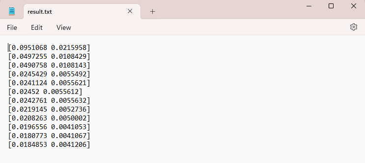
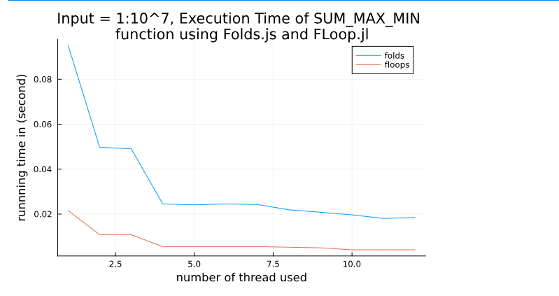

# РОССИЙСКИЙ УНИВЕРСИТЕТ ДРУЖБЫ НАРОДОВ
## Факультет физико-математических и естественных наук
### Кафедра прикладной информатики и теории вероятностей

## ОТЧЕТ ПО ЛАБОРАТОРНОЙ РАБОТЕ № 2
### *дисциплина: Параллельное программирование*

Выполнила: Ким Реачна, НПИбд-01-20

Москва
2023г.

---

**Задание №1**

Реализуйте параллельные версии суммирования, нахождения максимума и минимума для массива с большим количеством данных:

- Реализуйте различные подходы для вычисления суммы, максимума и минимума элементов в массиве, используя Folds и Floops

```julia
using Folds
using FoldsThreads
using FLoops
using BenchmarkTools
using Test
using Base.Threads
using Plots
using OnlineStats

function folds_sum_max_min(input_array)
    sum = Folds.sum(input_array, ThreadedEx())
    max = Folds.maximum(input_array, ThreadedEx())
    min = Folds.minimum(input_array, ThreadedEx())
    return (sum, max, min)
end

function floops_sum_max_min(arr)
    @floop for x in arr
        @reduce(s += x)
        @reduce() do (xmax = -Inf; x)
            if xmax < x
                xmax = x
            end
        end
        @reduce() do (xmin = Inf; x)
            if xmin > x
                xmin = x
            end            
        end
    end
    return (s, xmax, xmin)
end

input_array = 1:1e7 # change input result as you want, but this one is large enough to study

time_folds = @belapsed folds_sum_max_min(input_array)
time_floops = @belapsed floops_sum_max_min(input_array)
@testset begin
    @test folds_sum_max_min(input_array)[1] == floops_sum_max_min(input_array)[1]
    @test folds_sum_max_min(input_array)[2] == floops_sum_max_min(input_array)[2]
    @test folds_sum_max_min(input_array)[3] == floops_sum_max_min(input_array)[3]
end

println([time_folds time_floops])
```

- Чтобы запустить результат с $n=12$ - числом потоков процессора, создала пакетный файл, чтобы сохранить весь результат в файле ```result.txt```

```batch
set julia_path=D:\Soft\Julia-1.6.7\bin\julia.exe
set script_path=D:\work\study\2023-2024\lab02\task1.jl
set /a threads=12
set output_file=D:\work\study\2023-2024\lab02\result.txt

for /l %%i in (1,1,%threads%) do (
    %julia_path% --threads=%%i %script_path% >> %output_file%
)

```
После запуска мы получили результат времени выполнения в result.txt:



- Построить график времени выполнения

```julia
using Plots
data_length = range(1, 12, length=12)
# # Plot the data
data = [
    [0.0951068 0.0215958],
    [0.0497255 0.0108429],
    [0.0490758 0.0108143],
    [0.0245429 0.0055492],
    [0.0241124 0.0055621],
    [0.02452 0.0055612],
    [0.0242761 0.0055632],
    [0.0219145 0.0052736],
    [0.0208263 0.0050002],
    [0.0196556 0.0041053],
    [0.0180773 0.0041067],
    [0.0184853 0.0041206]
]

folds_times = [data[i][1] for i in 1:length(data)]
floops_times = [data[i][2] for i in 1:length(data)]
plot(data_length, [folds_times floops_times], label=["folds" "floops"], title="Input = 1:10^7, Execution Time of SUM_MAX_MIN \nfunction using Folds.js and FLoop.jl")
xlabel!("number of thread used")
ylabel!("runnning time in (second)")
```

Результат:



**Задание №2**

```julia
using Folds

function trapezoid_integral(f, a, b, n)
    h = (b - a) / n
    x_i = [a + i * h for i in 1:n]

    integral = foldl(+, begin
        sum(f(x_i[i]) for i in 1:n-1) * h / 2
    end)

    return integral
end

# Define the function to be integrated
f(x) = x^2

# Define the integration limits and the number of subintervals
a = 0.0
b = 1.0
n = 1000000

# Calculate the integral using the trapezoid rule
result = trapezoid_integral(f, a, b, n)

# Analytical solution (for the example function x^2)
analytical_solution = 1/3

# Print the result and compare it to the analytical solution
println("Numerical Result: ", result)
println("Analytical Solution: ", analytical_solution)

```
